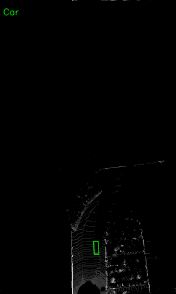

# Visualisation-perception-2D-3D

### Several tools for visualizing 3D perception result

## Contents

- [Visualisation for kitti dataset](#visualisation-for-kitti-dataset)

```bash
pip3 install -r requirement
```

## Visualisation for kitti dataset

```bash
cd visualize_kitti
python visua.py
```

- Let uncomment `draw_lidar_simple()` in `visualize_kitti/visua.py`  


- Let uncomment `show_lidar_with_boxes()` in `visualize_kitti/visua.py` 


- Let uncomment `show_image_with_boxes()` in `visualize_kitti/visua.py` 


- Let uncomment `show_lidar_on_image()` in `visualize_kitti/visua.py` 


- Let uncomment `show_lidar_topview_with_boxes()` in `visualize_kitti/visua.py` 
