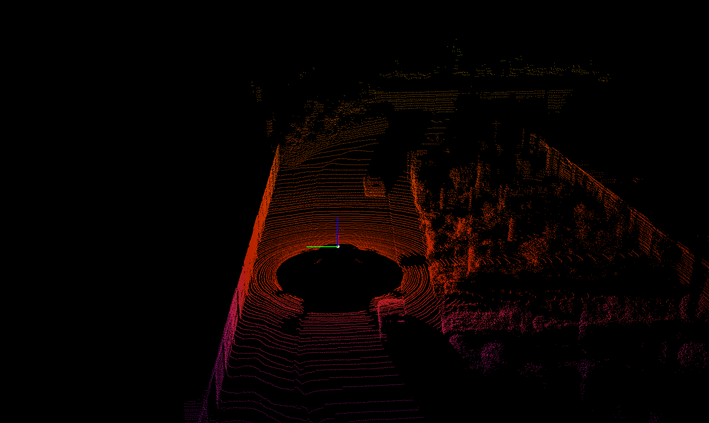
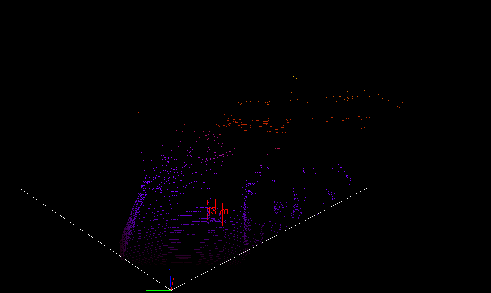
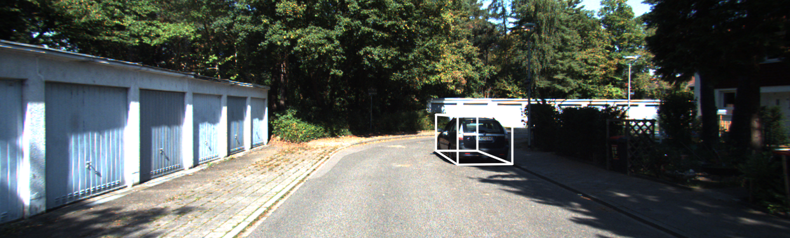
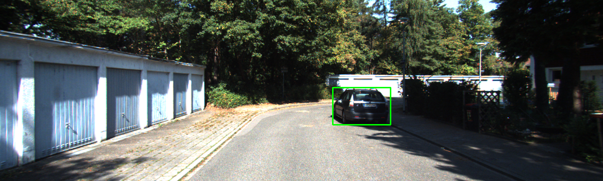
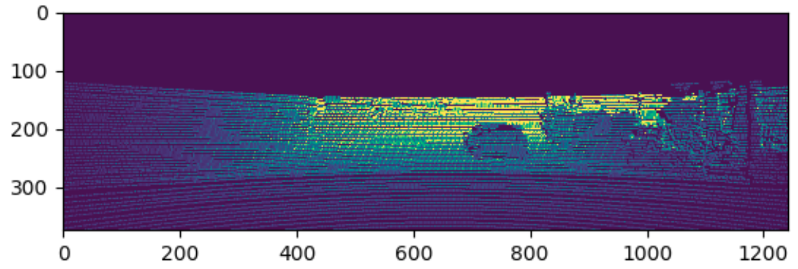
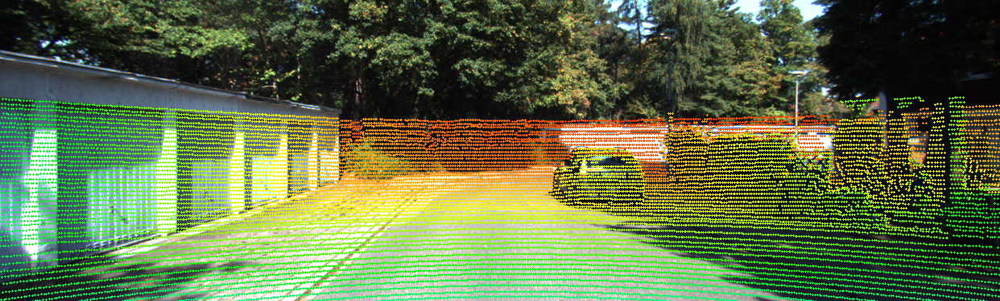
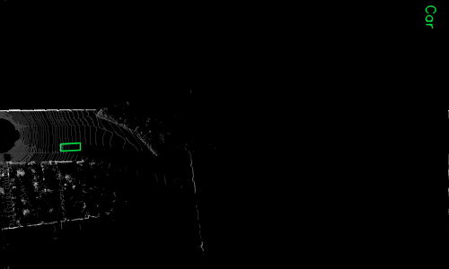

# Visualisation-perception-2D-3D

Several tools for visualizing 3D perception result

## Contents

- [Visualisation for kitti dataset](#visualisation-for-kitti-dataset)
- [Inverse projection RGBD](#inverse-projection-rgbd)

## Get started

Dependencies

- Ubuntu 16.04
- python 3.6 (pip, mkvirtualenv)
- mayavi 4.7.1
- Pyside2
- PyQt5
- vtk
- opencv 4.2.0.32
- numpy
- scipy
- open3d 0.7.0.0

Or run:

```bash
git clone https://github.com/maiminh1996/visualisation-perception-3D.git
cd visualisation-perception-3D/
pip3 install -r requirement.txt
```

## Visualisation for kitti dataset

Ref: [Explain kitti: sensors, calib, etc](https://github.com/maiminh1996/biblio-self-driving-cars/blob/master/dataset/kitti.md)

Run:

```bash
cd visualize_kitti/
python visua.py
```

Let uncomment these functions in `visualize_kitti/visua.py`  

| `draw_lidar_simple()` | `show_lidar_with_boxes()` |
| :--: | :--: | 
|  |  |
| `show_image_with_boxes()` | `show_lidar_on_image()` | 
|  <br/>  |  <br/>  |
| `show_lidar_topview_with_boxes()` | |
|  | |


## Inverse projection RGBD

Ref: [Explain inverse projection](https://github.com/darylclimb/cvml_project/tree/master/projections/inverse_projection)

Run:

```bash
# 2011_09_28_drive_0106_sync
cd inverse_projection_open3d/
python inverse_projection.py
```


Run:

```bash
python visua_pcl.py
```

